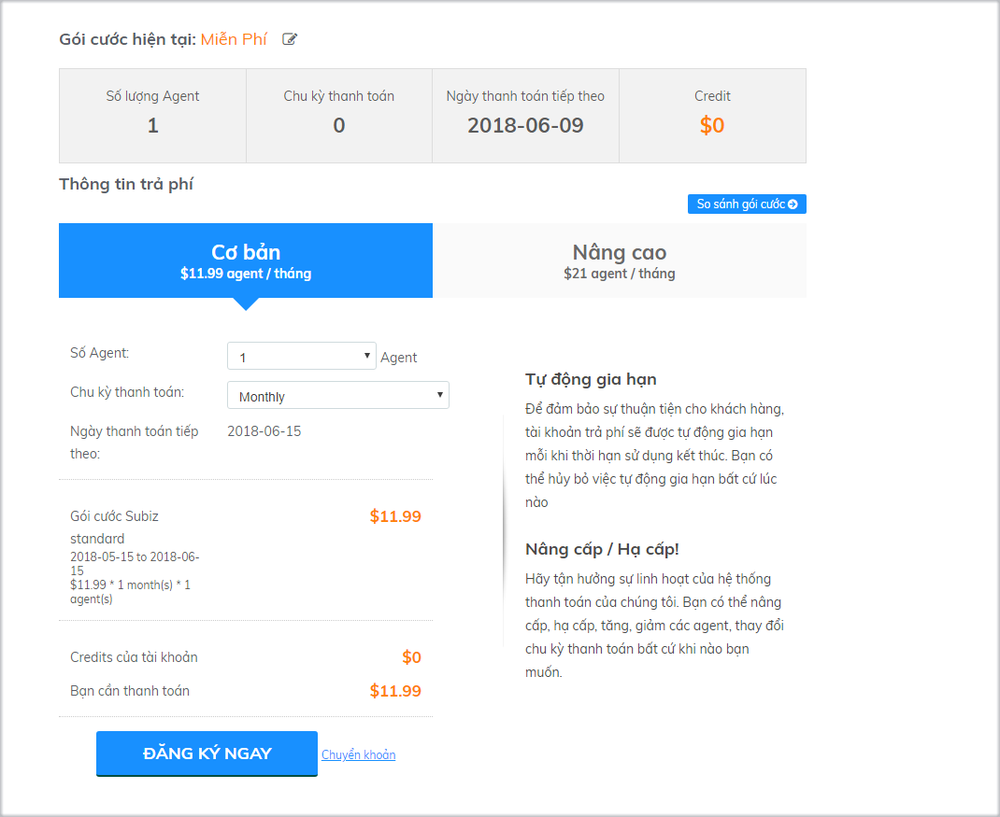
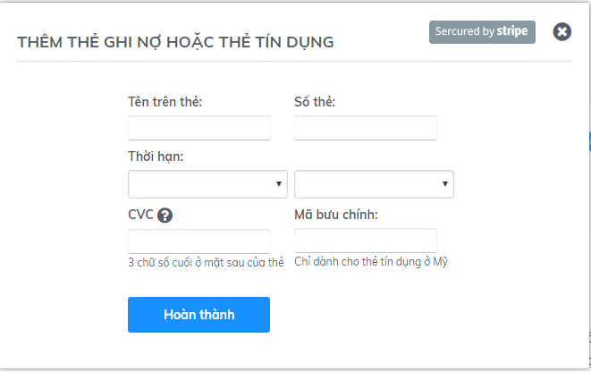
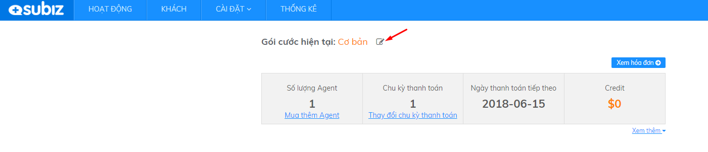
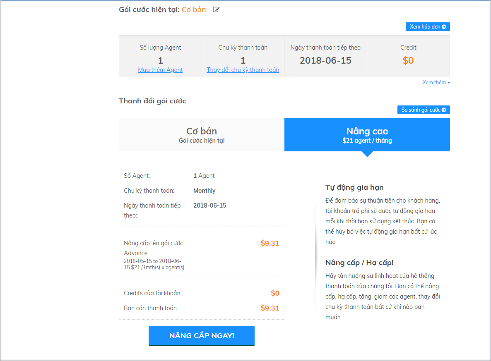
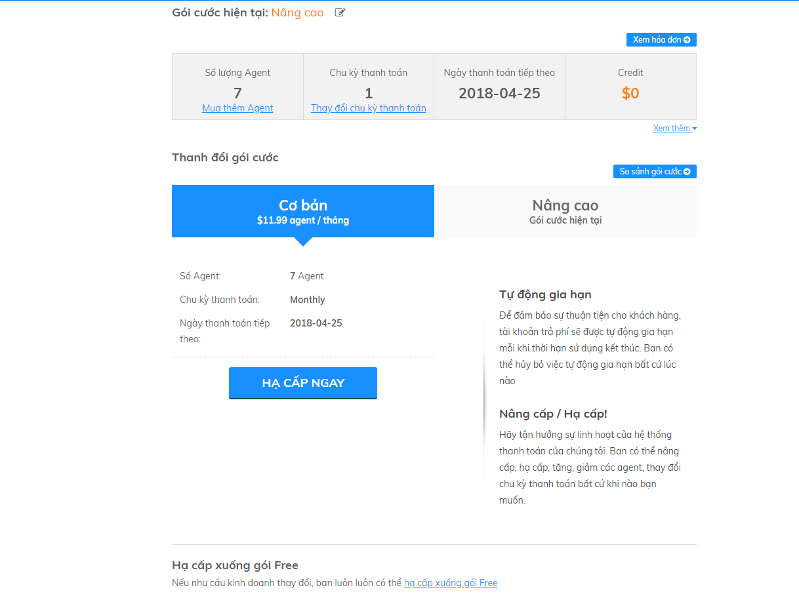

# Thay đổi gói dịch vụ

### Nâng/ Hạ tài khoản

#### Nâng cấp tài khoản

* **Tài khoản ở gói miễn phí**

Nếu tài khoản của bạn ở gói miễn phí và muốn nâng cấp lên gói trả phí, bạn cần đăng nhập vào trang [Thanh toán](https://app.subiz.com/payment-home) sau đó lựa chọn số lượng Agent và chu kỳ phù hợp rồi click vào phần `Đăng ký ngay`

Lúc này hệ thống sẽ phát sinh một Invoice để bạn tiến hành thanh toán:

Bạn có thể lựa chọn phương thức thanh toán theo 2 cách sau:

**Thanh toán qua thẻ : **Bạn cần điền đầy đủ thông tin thẻ trong mục:

**Thanh toán chuyển khoản: **Click vào mục` Chuyển khoản` , hệ thống sẽ hiển thị số tiền cần chuyển và thông tin tài khoản của Subiz.

* **Tài khoản ở gói Cơ bản**

Nếu bạn muốn nâng cấp gói Cơ bản lên gói Nâng Cao,  bạn click vào mục chỉnh sửa trong phần `Gói cước hiện tại`

Sau đó lựa chọn gói Nâng cao và tiến hành nâng cấp tài khoản:

#### Hạ cấp tài khoản

Để hạ cấp tài khoản, bạn vào mục `Gói cước hiện tại` và tiến hành hạ cấp tài khoản

