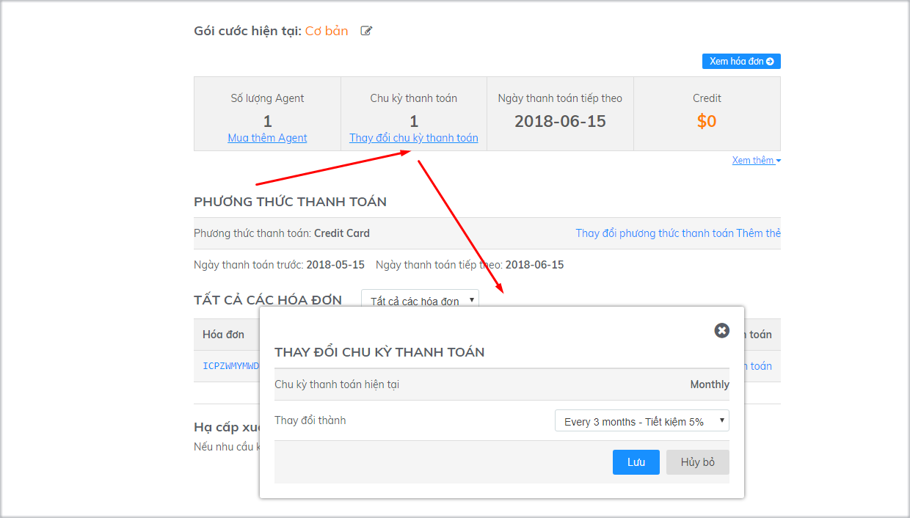

# Thay đổi gói dịch vụ

Trong quá trình sử dụng Subiz, tùy vào tình hình kinh doanh và chiến lược phát triển, bạn có thay đổi thông tin tài khoản bất cứ khi nào để phù hợp với nhu cầu của doanh nghiệp.

### Nâng/ Hạ tài khoản

#### Nâng cấp tài khoản

* **Tài khoản ở gói miễn phí**

Nếu tài khoản của bạn ở gói miễn phí và muốn nâng cấp lên gói trả phí, bạn cần đăng nhập vào trang [Thanh toán](https://app.subiz.com/payment-home) sau đó lựa chọn số lượng Agent và chu kỳ phù hợp rồi click vào phần **Đăng ký ngay**

* **Tài khoản ở gói Cơ bản**

Nếu bạn muốn nâng cấp gói Cơ bản lên gói Nâng Cao,  bạn click vào mục chỉnh sửa trong phần **Gói cước hiện tại**

Sau đó lựa chọn gói Nâng cao và tiến hành nâng cấp tài khoản:


Sau khi nâng cấp tài khoản, hệ thống sẽ phát sinh hóa đơn trong tài khoản của bạn. Bạn có thể lựa chọn thanh toán qua Thẻ tín dụng hoặc Chuyển khoản theo **Hướng dẫn thanh toán**


#### Hạ cấp tài khoản

Để hạ cấp tài khoản, bạn vào mục **Gói cước hiện tại** và tiến hành hạ cấp tài khoản

### Thay đổi số lượng Agent

#### Mua thêm Agent

Để tăng Agent bạn Click vào mục **Mua thêm Agent** sau đó lựa chọn số lượng Agent phù hợp:

**Giảm Agent**

Để giảm số lượng Agent, bạn vào mục **Xem thêm** sau đó thay đổi số lượng Agent phù hợp.

### Thay đổi chu kỳ thanh toán

Để thay đổi chu kỳ thanh toán, bạn click vào mục **Thay đổi chu kỳ thanh toán** và lựa chọn chu kỳ phù hợp:

### Hạ tài khoản xuống gói miễn phí

Tùy vào nhu cầu sử dụng và hoạt động kinh doanh, bạn có thể lựa chọn Hạ tài khoản xuống gói miễn phí và nâng cấp lại bất cứ khi nào:

