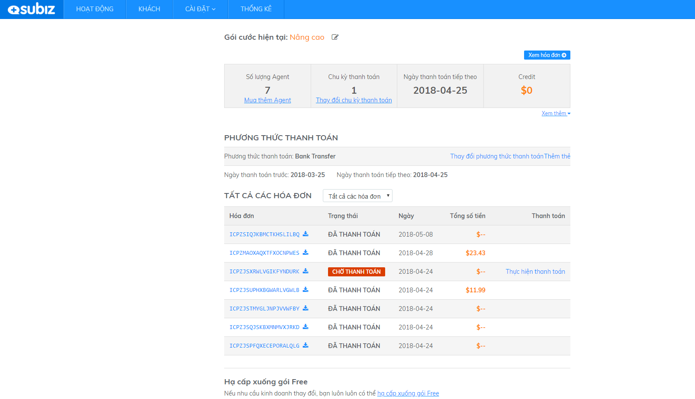

# Xem thông tin tài khoản hiện tại

Nếu bạn muốn quản lý các thông tin về tài khoản bao gồm gói cước, số lượng Agents, chu kỳ thanh toán, phương thức thanh toán... bạn có thể click vào  [trang thanh toán](https://app.subiz.com/payment-home).

Trang thanh toán bao gồm những thông tin sau:

* **Gói dịch vụ**: Bạn sẽ biết được tài khoản của bạn đang ở gói dịch vụ nào: Free, Standard/Trial, Standard, Advanced Free: Gói Miễn phí Trial: Tài khoản của bạn đang trong thời gian dùng thử Standard: Gói Cơ bản Advanced: Gói Nâng cao
* **Số lượng agent**: số lượng agent \(hỗ trợ viên\) được kích hoạt của tài khoản bạn
* **Chu kỳ thanh toán**: chu kỳ thanh toán ngắn hạn hay dài hạn sẽ giúp bạn dễ dàng kiểm soát khoảng thời gian đăng ký sử dụng dịch vụ trả phí của tài khoản \(chu kỳ 1 tháng/ 3 tháng/ 6 tháng/ 1 năm/ 2 năm\)
* **Ngày thanh toán tiếp theo**: thông tin chính xác về ngày thanh toán giúp bạn chủ động trong kế hoạch tiếp tục sử dụng tài khoản cho chu kỳ tới.
* **Credit**: là tín dụng trong thanh toán. Nó tồn tại trong tài khoản như một khoản tiền quỹ – hiểu đơn giản là “ví” của bạn, bạn có thể sử dụng để thanh toán bất cứ lúc nào, cho bất kỳ hóa đơn nào bạn lựa chọn. Lưu ý: số tiền thanh toán cần tương đương. \(Xem thêm về [cách sử dụng credit](https://docs.subiz.com/quan-ly-thong-tin-goi-dich-vu/#napcredit)\)
* **Phương thức thanh toán hiện tại**: Chuyển khoản hoặc Thẻ tín dụng. Bạn hoàn toàn có thể linh hoạt thay đổi phương thức thanh toán này bất kỳ lúc nào.
* **Danh sách hóa đơn**: Toàn bộ hóa đơn và trạng thái thanh toán của hóa đơn sẽ được hiển thị. Bạn dễ dàng kiểm soát việc thanh toán, dễ dàng tải về để tiện cho quá trình chia sẻ, lưu trữ.


**Lưu ý**: Chỉ có Agent Owner hoặc Agent được cấp quyền truy cập đầy đủ mục quản lý tài khoản mới xem được trang thanh toán.


